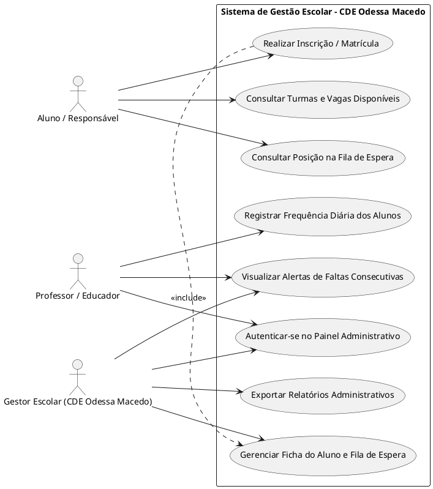
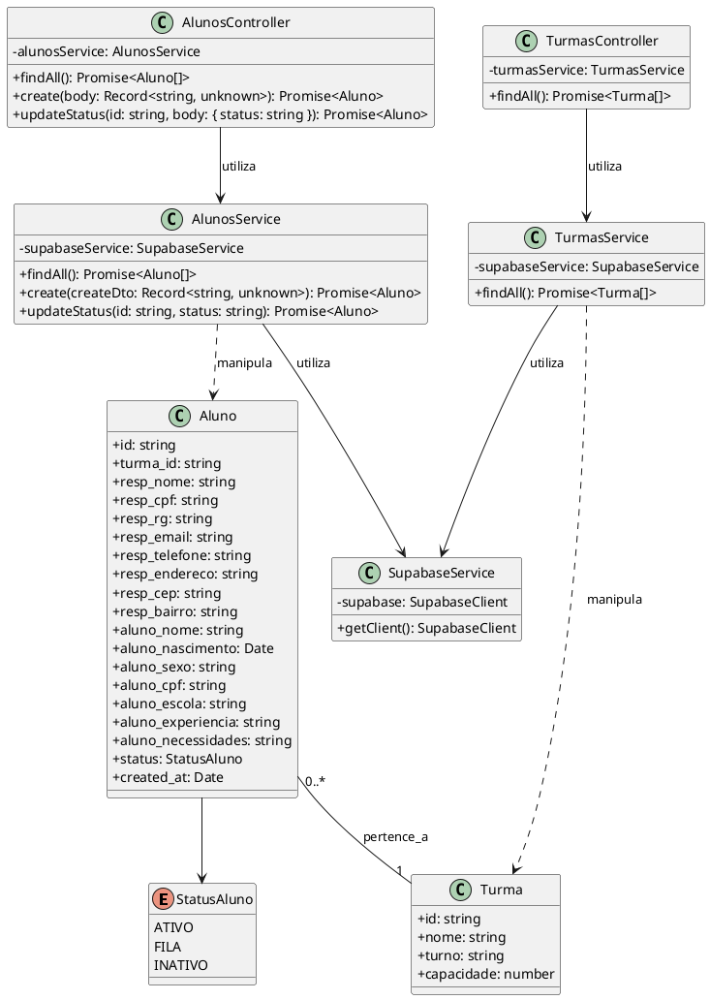
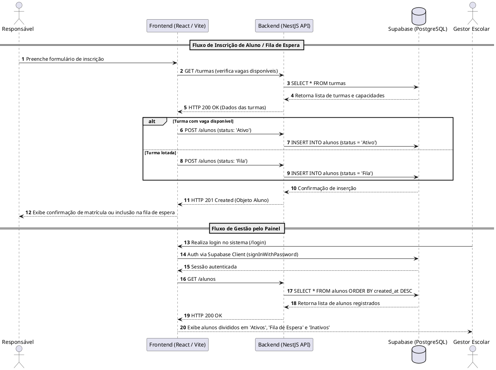
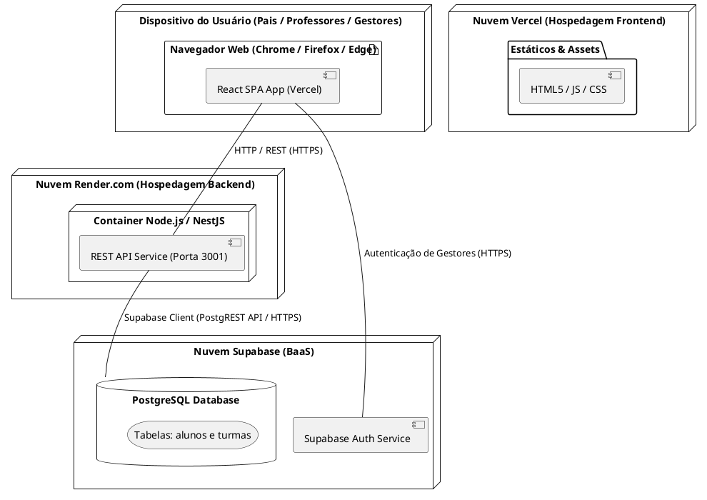

# Diagramas UML - Sistema de Gestão de Alunos e Fila de Espera (CDE Odessa Macedo)

Este documento reúne a especificação em código **PlantUML** dos principais diagramas de modelagem do sistema de gestão do CDE Odessa Macedo. Os códigos abaixo podem ser copiados e colados em ferramentas como o [PlantText](https://www.planttext.com/) ou o servidor oficial do [PlantUML](http://www.plantuml.com/plantuml/).

---

## 1. Diagrama de Casos de Uso

---

## 2. Diagrama de Classes (Domínio e Serviços)

---

## 3. Diagrama de Sequência: Inscrição e Gestão de Vagas

---

## 4. Diagrama de Implantação / Arquitetura

